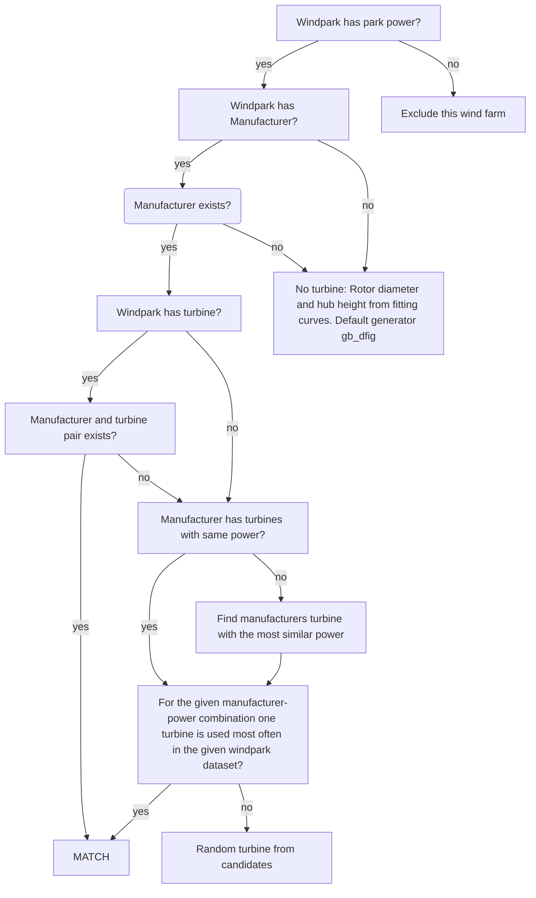

# turbines matching

```mermaid
graph TD
    HasParPower[Windpark has park power?]
    HasParPower -- yes --> HasMan
    HasParPower -- no --> EXCLUDE[Exclude this wind farm]
    HasMan[Windpark has Manufacturer?]
    HasMan -- yes --> ManExists
    HasMan -- " no " --> MAN_FIT_CURVE[No turbine: Rotor diameter and hub height from fitting curves. Default generator gb_dfig]
    ManExists(Manufacturer exists?)
    ManExists -- yes --> WPHasTurbine?
    ManExists -- " no " --> MAN_FIT_CURVE
    WPHasTurbine?[Windpark has turbine?]
    WPHasTurbine? -- yes --> ManTurbinePairExists?[Manufacturer and turbine pair exists?]
    WPHasTurbine? -- no --> PowerMatch?[Manufacturer has turbines with same power?]
    PowerMatch? -- " yes " --> OneMostCommon?
    PowerMatch? -- no --> CLOSEST[Find manufacturers turbine with the most similar power]
    CLOSEST --> OneMostCommon?[For the given manufacturer-power combination one turbine is used most often in the given windpark dataset?]
    OneMostCommon? -- " yes " --> MATCH
    OneMostCommon? -- no --> RND[Random turbine from candidates]
    ManTurbinePairExists? -- " yes " --> MATCH
    ManTurbinePairExists? -- no --> PowerMatch?
```
