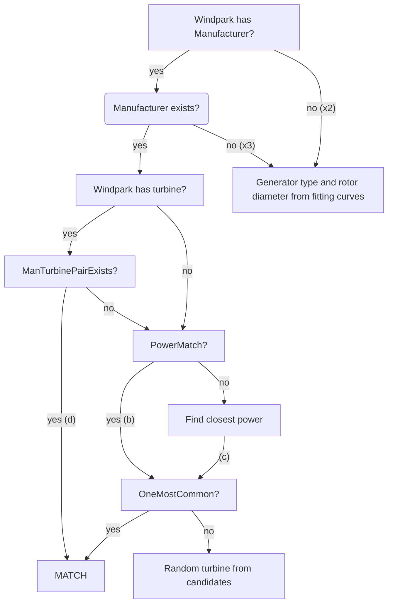
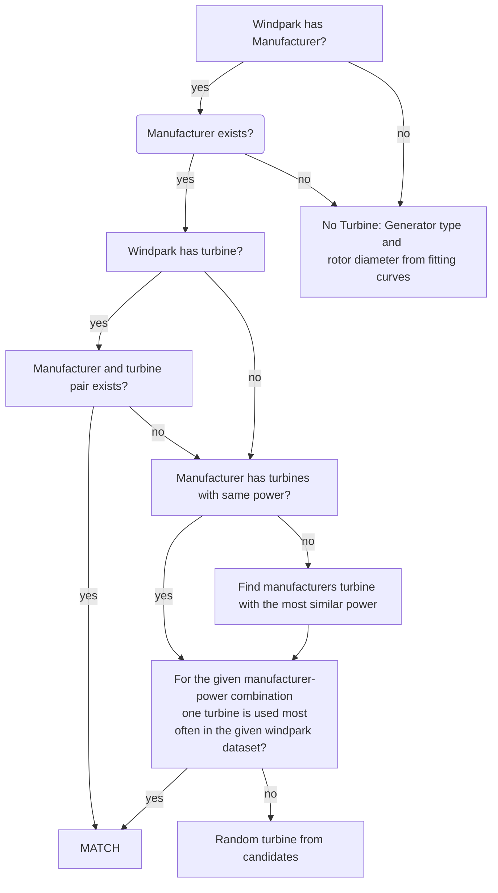

# turbines matching

```mermaid
graph TD
    HasMan[Windpark has Manufacturer?]
    HasMan -- yes --> ManExists
    HasMan -- " no (x2) " --> MAN_FIT_CURVE[Generator type and rotor diameter from fitting curves]
    ManExists(Manufacturer exists?)
    ManExists -- yes --> WPHasTurbine?
    ManExists -- " no (x3) " --> MAN_FIT_CURVE
    WPHasTurbine?[Windpark has turbine?]
    WPHasTurbine? -- yes --> ManTurbinePairExists?
    WPHasTurbine? -- no --> PowerMatch?
    PowerMatch? -- " yes (b) " --> OneMostCommon?
    PowerMatch? -- no --> CLOSEST[Find closest power]
    CLOSEST -- " (c) " --> OneMostCommon?
    OneMostCommon? -- " yes " --> MATCH
    OneMostCommon? -- no --> RND[Random turbine from candidates]
    ManTurbinePairExists? -- " yes (d) " --> MATCH
    ManTurbinePairExists? -- no --> PowerMatch?
```

clean

```mermaid
graph TD
    HasMan[Windpark has Manufacturer?]
    HasMan -- yes --> ManExists
    HasMan -- " no " --> MAN_FIT_CURVE[No Turbine: Generator type and \nrotor diameter from fitting curves]
    ManExists(Manufacturer exists?)
    ManExists -- yes --> WPHasTurbine?
    ManExists -- " no " --> MAN_FIT_CURVE
    WPHasTurbine?[Windpark has turbine?]
    WPHasTurbine? -- yes --> ManTurbinePairExists?[Manufacturer and turbine pair exists?]
    WPHasTurbine? -- no --> PowerMatch?[Manufacturer has turbines with same power?]
    PowerMatch? -- " yes " --> OneMostCommon?
    PowerMatch? -- no --> CLOSEST[Find manufacturers turbine with the most similar power]
    CLOSEST --> OneMostCommon?[For the given manufacturer-power combination\n one turbine is used most often in the given windpark dataset?]
    OneMostCommon? -- " yes " --> MATCH
    OneMostCommon? -- no --> RND[Random turbine from candidates]
    ManTurbinePairExists? -- " yes " --> MATCH
    ManTurbinePairExists? -- no --> PowerMatch?
```
